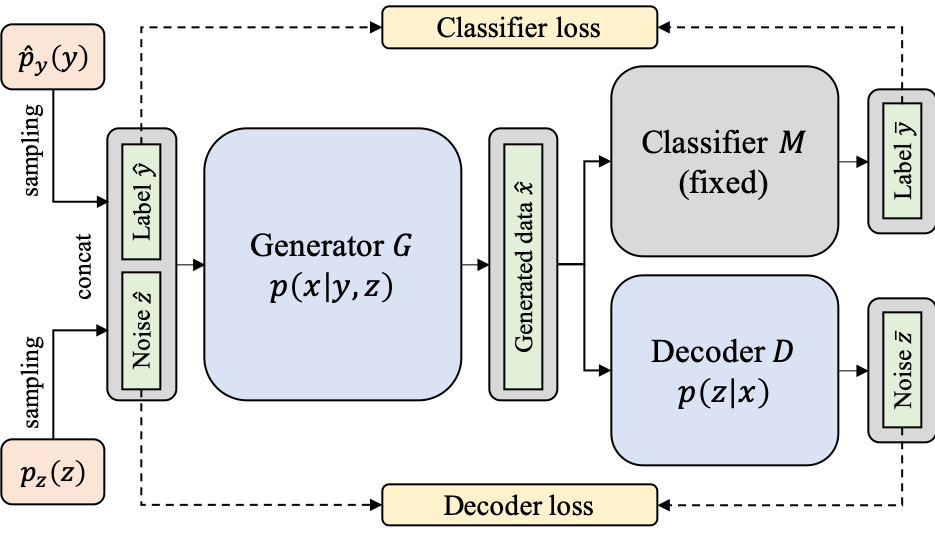
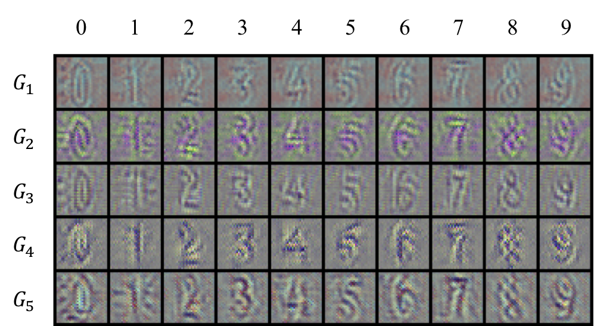

# KegNet

This project is a PyTorch implementation of Knowledge Extraction with No Observable Data (NeurIPS 2019).
This paper proposes a novel approach that extracts the knowledge of a deep neural network without any given data.

<p align="center">
    
</p>

## Prerequisites

- Python 3.6+
- [PyTorch](https://pytorch.org/)
- [NumPy](https://numpy.org)
- [Scipy](https://scipy.org/)
- [pandas](https://pandas.pydata.org/)
- [TensorLy](http://tensorly.org/stable/index.html)

## Usage

You can run the demo script by `bash demo.sh`, which simply runs `src/main.py`.
It trains five generators based on the pretrained LeNet5 model of `pretrained/mnist.pth.tar` and then uses it to train a student network from its extracted knowledge.
You can change the dataset, pretrained model, and number of generators by modifying `src/main.py`.
It is also possible to modify directly our model package such to change the hyperparameters such as learning rates, network structures, sampling distributions, and so on.

The following figure visualizes artificial images for the SVHN dataset, generated from our five generators.
The digits are clearly recognizable despite the noises, representing that our generators are capable of capturing essential properties of the data distribution given a trained teacher network.

<p align="center">
    
</p>

## Reference

You can download [this bib file](docs/YooCKK19.bib) or copy the following information: 

```
@incollection{NIPS2019_8538,
title = {Knowledge Extraction with No Observable Data},
author = {Yoo, Jaemin and Cho, Minyong and Kim, Taebum and Kang, U},
booktitle = {Advances in Neural Information Processing Systems 32},
editor = {H. Wallach and H. Larochelle and A. Beygelzimer and F. d\textquotesingle Alch\'{e}-Buc and E. Fox and R. Garnett},
pages = {2701--2710},
year = {2019},
publisher = {Curran Associates, Inc.},
url = {http://papers.nips.cc/paper/8538-knowledge-extraction-with-no-observable-data.pdf}
}
```
